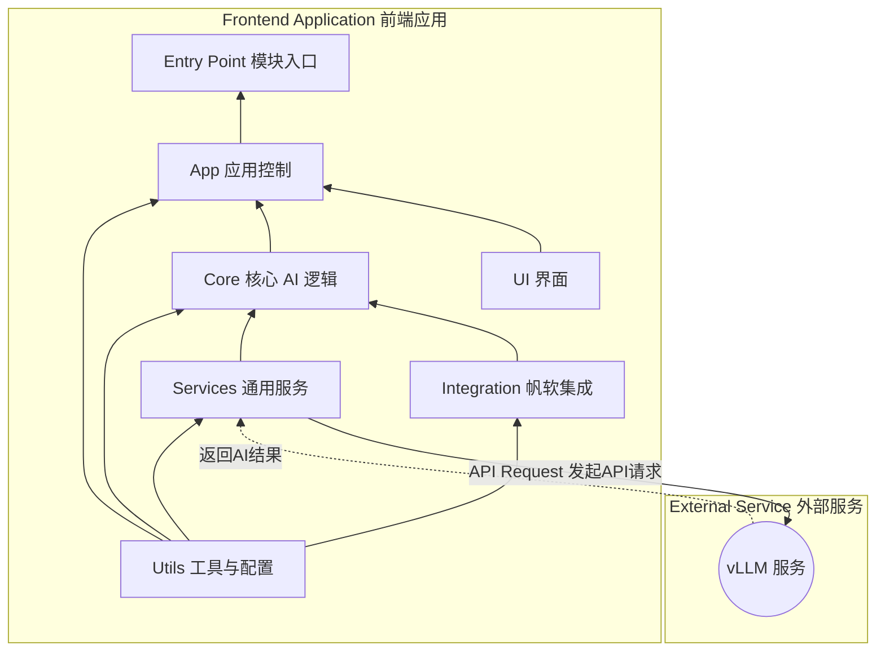

# 🤖 智帆报表 (Smart FineReport Dashboard)

**Language**: [中文](README.md) | [English](README_EN.md)

GitHub Repo: https://github.com/HaochenFa/Smart-FineReport

一个集成 AI 分析功能的帆软报表 (FineReport) 框架。该项目当前版本为 v1.2.0-vision，其核心思想是：通过捕获报表界面的截图，并将其发送给多模态大语言模型（vLLM
部署），从而实现对报表数据的智能分析。

## 核心功能

- 📸 **截图分析**：通过 `html2canvas` 等技术将当前报表视图渲染为图片，并将其作为核心分析依据。
- 🤖 **多模态对话**：将用户提问和报表截图一同发送给多模态大模型，生成包含总结、洞察和建议的分析报告。
- 💬 **多轮次交互**：支持用户围绕报表截图和生成的分析报告，与 AI 进行多轮次的追问和探讨。
- 📊 **富文本展示**：支持 Markdown 格式的分析报告，提供更清晰、专业的阅读体验。

## 开发环境要求

- **Node.js**: v18.x+ 或其他兼容版本
- **npm**: v10.x+ 或其他兼容版本

### 快速开始

1. **安装依赖**：

   ```bash
   npm install
   ```

2. **开发模式**：

   ```bash
   npm run dev
   ```

3. **代码检查和构建**：

   ```bash
   npm run build
   ```

## 部署方式

智帆报表 AI 助手设计为可嵌入式组件，部署到帆软环境主要涉及以下步骤：

- **构建前端脚本**：使用 Rollup 将项目文件打包成单一的 JavaScript 文件。
- **配置后端 API 地址**：在前端 `src/utils/settings.js` 中直接配置后端 API 地址（支持回退阵列）。
- **文件部署与帆软集成**：将打包后的文件部署到服务器，并在帆软设计器中引入。

## 项目架构

### 架构设计



### 文件结构

```plaintext
/SmartFineReport
├── docs/               # Project documentation
│   └── DEPLOYMENT_GUIDE.md
├── public/             # Public assets and HTML entry
│   ├── assets/         # Static assets
│   │   ├── logo.png
│   │   ├── logo-40w.png
│   │   ├── logo-80w.png
│   │   └── logo-120w.png
│   ├── dist/           # Build output directory
│   │   ├── smart-finereport.cjs.min.js
│   │   ├── smart-finereport.esm.min.js
│   │   └── *.css       # Generated CSS files
│   ├── index.html
│   └── smart-fr-plugin.js
└── src/                # Source files
    ├── App.svelte          # Main Svelte application component
    ├── main.js             # The Main Entrance
    ├── app/            # Application control and initialization
    │    ├── app-controller.js        # Core service
    │    └── state-manager.js         # UI <-> Backend bridging
    ├── core/           # Core AI and analysis logic
    │    ├── ai-analysis-pipeline.js  # AI service controller
    │    ├── context-manager.js       # Manage context (conversation)
    │    ├── prompt-builder.js        # Build structured prompts
    │    └── vllm-interface.js        # Connect to vLLM service
    ├── services/       # Common services
    │    └── api-service.js           # General API service wrapper
    ├── styles/         # Application styles
    │    ├── fab.css
    │    ├── main.css
    │    └── tailwind.js
    ├── ui/             # User interface components
    │    ├── ChatView.svelte          # Svelte chat window component
    │    └── ui-manager.js            # Control UI status
    └── utils/          # Utility functions and configs
         ├── default-prompt.js        # Prompt template
         ├── logger.js                # Logger
         └── settings.js              # Static config and secrets
```

## 生产环境部署

项目的部署包含两个核心步骤：构建前端脚本、在帆软中集成。

### 步骤 1: 构建前端脚本

在您的**本地开发环境**中执行以下操作。

1. **配置后端 API 地址**: 打开 `src/utils/settings.js` 文件，修改`SETTINGSservice.url` 的值，使其指向您的实际后端 API 地址数组。

```javascript
export const SETTINGS = {
  service: {
    url: [
      "http://placeholder-backend-api-address-1/api/v1/chat/completions", // 请替换为您的实际后端API地址
      "http://placeholder-backend-api-address-2/api/v1/generate", // 请替换为您的实际后端API地址
    ],
    proxy: "https://placeholder-proxy-address.com",
  },
  logger: {
    level: "log",
  },
};
```

2. **执行构建**: 在项目根目录下运行打包命令：

```bash
   npm run build
```

3. **获取产物**: 构建成功后，`public/dist/` 目录下会生成 `smart-finereport.cjs.min.js` (CommonJS 格式)、`smart-finereport.esm.min.js` (ES Module 格式) 以及对应的 CSS 文件。

### 步骤 2: 文件部署与帆软集成

1. **部署文件**: 将 `public/dist/*.cjs.min.*`、`public/dist/*.esm.min.*`、`public/smart-fr-plugin.js` 和 `src/styles/tailwind.js`
   文件复制到您服务器上的一个公共可访问文件夹中，例如 `your_server_root/public/smartfinereport/`。
2. **帆软设计器配置**: 在帆软设计器中，点击顶部菜单栏的 `服务器 -> 服务器配置 -> 引入JavaScript文件`。
3. **引入路径**: 在弹出的对话框中，分别输入您部署的 JavaScript 和 CSS 文件的绝对路径。例如，如果您的文件部署在
   `your_server_root/public/smartfinereport/`，则 JavaScript 文件输入
   `/public/smartfinereport/smart-finereport.cjs.min.js`，CSS 文件输入
   `/public/smartfinereport/smart-finereport.cjs.min.css` (如果存在)。
4. **验证**: 部署完成后，预览您的帆软报表，验证 AI 助手功能是否正常加载和运行。

更多详细信息请参考 [DEPLOYMENT GUIDE](docs/DEPLOYMENT_GUIDE.md)

## License

本项目采用 MIT 许可证。详情请参阅 [LICENSE](LICENSE) 文件。
