# 🤖 智帆报表 (Smart FineReport Dashboard)

一个集成 AI 分析功能的帆软报表 (FineReport) 框架。该项目当前版本为 v1.0.0-vision，其核心思想是：通过捕获报表界面的截图，并将其发送给多模态大语言模型（vLLM
部署），从而实现对报表数据的智能分析。

## 核心功能

- 📸 **截图分析**：通过 `html2canvas` 等技术将当前报表视图渲染为图片，并将其作为核心分析依据。
- 🤖 **多模态对话**：将用户提问和报表截图一同发送给多模态大模型，生成包含总结、洞察和建议的分析报告。
- 💬 **多轮次交互**：支持用户围绕报表截图和生成的分析报告，与 AI 进行多轮次的追问和探讨。

## 部署方式

- 在帆软 (FineReport) 中定义一个「按钮事件 Button Event」，或者在 HTML 框架中创建 `<scripts> </scripts>`
- 使用 rollup 工具将项目文件打包成单一的 JS 文件
- 在按钮事件或 `<script></script>` 代码块中导入 JS 文件

### 环境变量配置

为了增强安全性，BFF (Backend for Frontend) 服务支持通过环境变量来配置 API KEY。您可以在 `bff/` 目录下创建一个 `.env`
文件，并按以下格式添加您的 API KEY：

```plaintext
LLM_API_KEYS=your_api_key_1,your_api_key_2
LLM_FALLBACK_URLS=http://127.0.0.1:8080,http://127.0.0.1:8081
```

- `LLM_API_KEYS`：一个以逗号分隔的 API KEY 列表。BFF 服务会根据 `LLM_FALLBACK_URLS` 的顺序，为每个请求附加对应的 KEY。
- `LLM_FALLBACK_URLS`：一个以逗号分隔的 vLLM 服务 URL 列表。BFF 服务会按顺序尝试连接，直到成功为止。

## 项目架构

### 架构设计

[//]: # "```mermaid"

[//]: # "flowchart BT"

[//]: # "    id0[BFF 后端代理服务]"

[//]: # "    id1[Utils 工具与配置]"

[//]: # "    id2[Services 通用服务]"

[//]: # "    id3[Integration 帆软集成]"

[//]: # "    id4[Core 核心 AI 逻辑]"

[//]: # "    id5[UI 界面]"

[//]: # "    id6[App 应用控制]"

[//]: # "    id7[Entry Point 模块入口]"

[//]: # "    id0 --> id2"

[//]: # "    id1 --> id2"

[//]: # "    id2 --> id3 --> id4 --> id5 --> id6 --> id7"

[//]: # "```"

```mermaid
flowchart BT
    subgraph "External Service 外部服务"
        id0((BFF 后端代理服务))
        id_vLLM((vLLM 服务))
    end

    subgraph "Frontend Application 前端应用"
        id1[Utils 工具与配置]
        id2[Services 通用服务]
        id3[Integration 帆软集成]
        id4[Core 核心 AI 逻辑]
        id5[UI 界面]
        id6[App 应用控制]
        id7[Entry Point 模块入口]
    end

%% 依赖关系与请求流 (实线)
    id2 -- " API Request 发起API请求 " --> id0
    id1 --> id2
    id1 --> id3
    id1 --> id4
    id1 --> id6
    id2 --> id4
    id3 --> id4
    id4 --> id6
    id5 --> id6
    id6 --> id7
    id0 -- " Forward & Authenticate 转发并鉴权 " --> id_vLLM
%% 响应流 (虚线)
    id_vLLM -.->|" 返回AI结果 "| id0
    id0 -.->|" 返回给前端 "| id2
```



### 文件结构

```plaintext
/SmartFineReport
├── src/                # Source files
│   ├── main.js             # The Main Entrance
│   ├── app/            # Application control and initialization
│   │    ├── app-controller.js        # Core service
│   │    └── state-manager.js         # UI <-> Backend bridging
│   ├── core/           # Core AI and analysis logic
│   │    ├── ai-analysis-pipeline.js  # AI service controller
│   │    ├── context-manager.js       # Manage context (conversation)
│   │    ├── vllm-interface.js        # Connect to vLLM service
│   │    └── prompt-builder.js        # Build structured prompts
│   ├── integration/    # FineReport integration (v1.5.x)
│   │    ├── data-processor.js        # (v1.5.x) Organize and clean raw data
│   │    └── fr-interface.js          # (v1.5.x) Fetch FR data
│   ├── services/       # Common services
│   │    └── api-service.js           # General API service wrapper
│   ├── ui/             # User interface components
│   │    ├── chat-view.js             # Basic chat window implementation
│   │    └── ui-manager.js            # Control UI status
│   └── utils/          # Utility functions and configs
│        ├── default-prompt.js        # Prompt template
│        ├── logger.js                # Logger
│        └── settings.js              # Static config and secrets
│
└──tests/               # Test files
    ├── e2e/            # E2E tests
    └── integration/    # Integration tests
         └── full-analysis-flow.test.js # Statndard path integration test
```

## 开发计划

项目当前处于 `v1.0.0-vision-alpha` 阶段，核心的视觉分析功能已开发完成。后续计划将聚焦于稳定性和用户体验提升，直至正式上线。

### v1.0: 视觉分析核心 (已完成)

-   [x] **核心框架**: 完成了基于截图和多模态模型的 AI 分析流程。
-   [x] **前端界面**: 开发了可嵌入的、由状态驱动的聊天 UI 组件。
-   [x] **后端代理 (BFF)**: 建立了用于 API 密钥管理和安全请求转发的 BFF 服务。
-   [x] **构建与样式**: 集成了 Rollup 打包流程和 Tailwind CSS，并解决了样式隔离问题。
-   [x] **核心逻辑测试**: 编写了覆盖核心模块的单元测试和集成测试。

### 后续计划

-   [ ] **环境部署与测试**:
    -   [ ] 部署到内部测试环境，进行全面的功能验证。
    -   [ ] 部署到预生产环境，与真实的帆软看板进行集成测试。
-   [x] **UI/UX 优化**:
    -   [x] 根据测试反馈，进一步优化 UI 布局和交互细节，提升用户体验。
    -   [x] 增强 UI 对不同尺寸看板和屏幕的响应式适配能力。
-   [ ] **端到端 (E2E) 测试**: 编写自动化 E2E 测试用例，模拟用户从点击按钮到获取分析结果的完整流程。
-   [ ] **文档完善**: 更新和完善最终用户使用手册和开发者文档。
-   [ ] **正式上线**: 在完成所有测试和优化后，正式发布 v1.0.0 版本。

## 生产环境部署

项目的部署包含三个核心步骤：部署后端 BFF 服务、构建前端脚本、在帆软中集成。

### 步骤 1: 部署 BFF 后端服务

BFF (Backend for Frontend) 是一个独立的 Node.js 服务，负责安全地管理 API 密钥和代理请求。**必须将其部署在服务器环境中**。

1. **上传文件**: 将项目根目录下的 `bff/` 文件夹完整上传到您的服务器。
2. **配置环境变量**: 进入服务器的 `bff/` 目录，创建一个 `.env` 文件，并配置以下变量：
   ```plaintext
   # .env
   LLM_API_KEYS=your_api_key_1,your_api_key_2
   LLM_FALLBACK_URLS=http://vllm-service-1.com,http://vllm-service-2.com
   ```
3. **安装依赖**: 在服务器的 `bff/` 目录中执行：
   ```bash
   npm install
   ```
4. **启动服务**: 为了保证服务稳定性，推荐使用进程守护工具 `pm2`。
   ```bash
   # 全局安装 pm2 (如果尚未安装)
   npm install -g pm2

   # 使用 pm2 启动服务
   pm2 start index.js --name "smart-finereport-bff"
   ```
   请确保 BFF 服务所在的端口（默认为 3001）已在防火墙中开放，并记录下其访问地址，例如 `http://your-server-ip:3001`。

### 步骤 2: 构建前端脚本

在您的**本地开发环境**中执行以下操作。

1. **配置 BFF 地址**: 打开 `src/utils/settings.js` 文件，修改 `SETTINGS.service.url` 的值，使其指向您在上一步中部署的 BFF
   服务地址。
2. **执行构建**: 在项目根目录下运行打包命令：
   ```bash
   npm run build
   ```
3. **获取产物**: 构建成功后，在 `dist/` 目录下找到 `smart-finereport.umd.js` 文件。将此文件上传到 CDN 或帆软服务器的静态资源目录，确保能通过
   URL 公开访问。

### 步骤 3: 在帆软中集成

1. **添加容器**: 在帆软看板设计器中，拖入一个 HTML 组件，并写入以下内容以创建挂载点。聊天窗口将在此渲染。
   ```html
   <div id="smartfine-chat-container"></div>
   ```
2. **添加按钮**: 在看板上添加一个按钮，用于触发 AI 分析助手。
3. **配置按钮点击事件**: 为该按钮添加点击事件，并粘贴以下 JavaScript 代码。这是推荐的动态加载方式，可以避免不必要的性能开销。

   ```javascript
   // 请将 scriptUrl 替换为您在步骤 2 中上传的 JS 文件地址
   const scriptUrl = 'https://your-cdn.com/path/to/smart-finereport.umd.js';

   // 检查脚本是否已加载，防止重复执行
   if (window.initAIAssistant) {
     window.initAIAssistant({
       containerSelector: '#smartfine-chat-container',
       fineReportInstance: _g() // _g() 或 FR 是帆软的全局对象，请按需传入
     });
   } else {
     const script = document.createElement('script');
     script.src = scriptUrl;
     script.onload = function() {
       window.initAIAssistant({
         containerSelector: '#smartfine-chat-container',
         fineReportInstance: _g()
       });
     };
     document.head.appendChild(script);
   }
   ```

## 开发调试

- 安装依赖：

```bash
cd SmartFineReport/ &&
npm install
```

- 运行测试：

```bash
npm test
```
