# 🤖 智帆报表 (Smart FineReport Dashboard)

一个集成 AI 分析功能的帆软报表 (FineReport) 框架。通过帆软提供的 JS API 抓取面板数据，并以结构化 (JSON) 格式创建提示词传递给通过
vLLM 部署的 LLM。

## 核心功能

- 📊 抓取帆软报表面板数据，并按照数据类型 (表格、图表、交叉表等等) 分别传递给 LLM
- 🧐 生成标准的数据分析报告，包括 总结分析、措施分析、改善建议、关键数据、下一步行动 等
- 💬 支持用户根据生成的默认分析报告与 LLM 进行多轮次对话交流

## 部署方式

- 在帆软 (FineReport) 中定义一个「按钮事件 Button Event」，或者在 HTML 框架中创建 `<scripts> </scripts>`
- 使用 rollup 工具将项目文件打包成单一的 JS 文件
- 在按钮事件或 `<script></script>` 代码块中导入 JS 文件

## 项目架构

### 架构设计

[//]: # (```mermaid)

[//]: # (flowchart BT)

[//]: # (    id0[BFF 后端代理服务])

[//]: # (    id1[Utils 工具与配置])

[//]: # (    id2[Services 通用服务])

[//]: # (    id3[Integration 帆软集成])

[//]: # (    id4[Core 核心 AI 逻辑])

[//]: # (    id5[UI 界面])

[//]: # (    id6[App 应用控制])

[//]: # (    id7[Entry Point 模块入口])

[//]: # (    id0 --> id2)

[//]: # (    id1 --> id2)

[//]: # (    id2 --> id3 --> id4 --> id5 --> id6 --> id7)

[//]: # (```)



```mermaid
flowchart BT
    subgraph "External Service 外部服务"
        id0((BFF 后端代理服务))
        id_vLLM((vLLM 服务))
    end

    subgraph "Frontend Application 前端应用"
        id1[Utils 工具与配置]
        id2[Services 通用服务]
        id3[Integration 帆软集成]
        id4[Core 核心 AI 逻辑]
        id5[UI 界面]
        id6[App 应用控制]
        id7[Entry Point 模块入口]
    end

%% 依赖关系与请求流 (实线)
    id2 -- " API Request 发起API请求 " --> id0
    id1 --> id2
    id1 --> id3
    id1 --> id4
    id1 --> id6
    id2 --> id4
    id3 --> id4
    id4 --> id6
    id5 --> id6
    id6 --> id7
    id0 -- " Forward & Authenticate 转发并鉴权 " --> id_vLLM
%% 响应流 (虚线)
    id_vLLM -.->|" 返回AI结果 "| id0
    id0 -.->|" 返回给前端 "| id2
```

### 文件结构

```plaintext
/SmartFineReport
├── main.js             # The Main Entrance
├── src/                # Source files
│   ├── app/            # Application control and initialization
│   │    ├── app-controller.js        # Core service
│   │    └── state-manager.js         # UI <-> Backend bridging
│   ├── core/           # Core AI and analysis logic
│   │    ├── ai-analysis-pipeline.js  # AI service controller
│   │    ├── context-manager.js       # Manage context (conversation)
│   │    ├── vllm-interface.js        # Connect to vLLM service
│   │    └── prompt-builder.js        # Build structured prompts
│   ├── integration/    # FineReport integration
│   │    ├── data-processor.js        # Organize and clean raw data
│   │    └── fr-interface.js          # Fetch FR data
│   ├── services/       # Common services
│   │    └── api-service.js           # General API service wrapper
│   ├── ui/             # User interface components
│   │    ├── chat-view.js             # Basic chat window implementation
│   │    └── ui-manager.js            # Control UI status
│   └── utils/          # Utility functions and configs
│        ├── default-prompt.js        # Prompt template
│        ├── logger.js                # Logger
│        └── settings.js              # Static config and secrets
│
└──tests/               # Test files
    ├── e2e/            # E2E tests
    └── integration/    # Integration tests
         └── full-analysis-flow.test.js # Statndard path integration test
```

## 开发计划

1. [x] 工具配置：日志记录、静态配置、默认提示词模版
2. [x] 通用服务：API 服务的封装（POST）
3. [x] 帆软集成：帆软 JS API 的封装
4. [x] 数据清理：清理并结构化获取的原始数据
5. [x] AI 服务：vLLM API 封装
6. [x] 提示词整理：根据模版规范填充数据
7. [x] 上下文管理：整理对话历史，自动清理旧对话
8. [x] AI 核心服务管理：AI 服务协调器
9. [x] 单元测试：编写底层核心服务单元测试
10. [x] UI 界面：编写基础 UI 界面
11. [x] APP 控制：创建整体核心控件
12. [x] 单元测试：编写顶层组件单元测试
13. [x] 编写入口文件
14. [x] 集成测试：调试项目是否顺利运行
15. [ ] 编写 `rollup.config.js`
16. [ ] BFF 代理服务：将 API KEY 等敏感信息存放在后端
17. [ ] API KEY 健壮性：判断传入的配置是否含有 KEY，若不包含 KEY 则忽略该字段
18. [ ] 部署进入测试环境
19. [ ] UI 适配：适配面板 UI 设计
20. [ ] 部署进入预生产环境
21. [ ] E2E 端到端测试
22. [ ] 正式上线

## 部署调试

- 安装依赖：

```bash
cd SmartFineReport/ &&
npm install
```

- 测试：

```bash
npm test
```