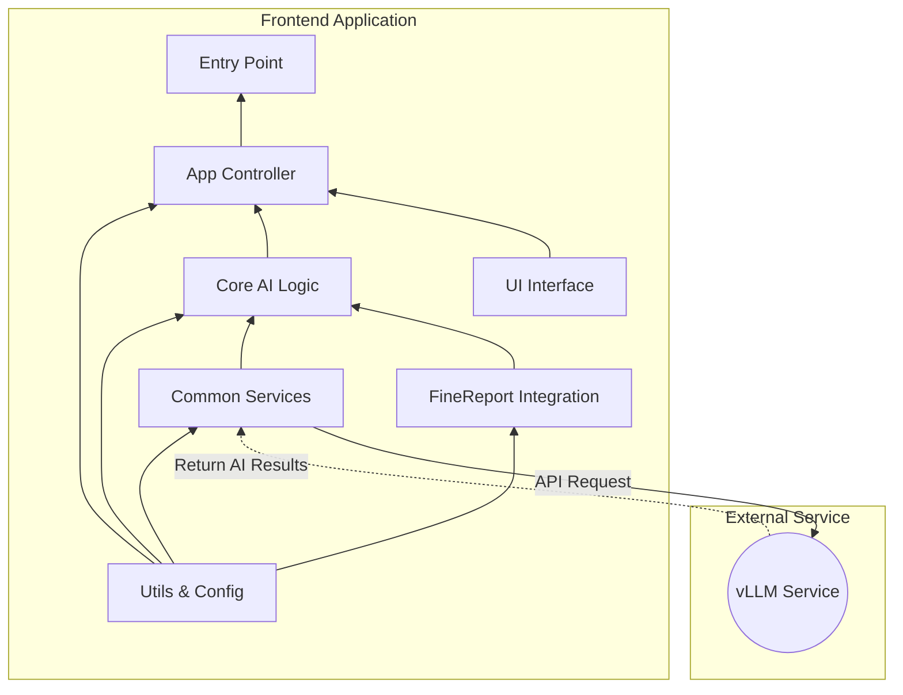

# 🤖 Smart FineReport Dashboard

GitHub Repo: https://github.com/HaochenFa/Smart-FineReport

An AI-integrated FineReport framework. The current version is v1.2.0-vision, with the core concept of capturing report interface screenshots and sending them to multimodal large language models (vLLM deployment) to achieve intelligent analysis of report data.

## Core Features

- 📸 **Screenshot Analysis**: Render the current report view as an image using technologies like `html2canvas` and use it as the core analysis basis.
- 🤖 **Multimodal Dialogue**: Send user questions and report screenshots together to multimodal large models to generate analysis reports containing summaries, insights, and recommendations.
- 💬 **Multi-turn Interaction**: Support users to engage in multi-turn questioning and discussion with AI around report screenshots and generated analysis reports.
- 📊 **Rich Text Display**: Support Markdown format analysis reports, providing clearer and more professional reading experience.

## Development Environment Requirements

- **Node.js**: v18.x+ or other compatible versions
- **npm**: v10.x+ or other compatible versions

### Quick Start

1. **Install Dependencies**:

   ```bash
   npm install
   ```

2. **Development Mode**:

   ```bash
   npm run dev
   ```

3. **Code Check and Build**:

   ```bash
   npm run build
   ```

## Deployment Method

Smart FineReport AI Assistant is designed as an embeddable component. Deployment to FineReport environment mainly involves the following steps:

- **Build Frontend Scripts**: Use Rollup to package project files into a single JavaScript file.
- **Configure Backend API Address**: Configure backend API address directly in frontend `src/utils/settings.js` (supports fallback array).
- **File Deployment and FineReport Integration**: Deploy packaged files to server and import them in FineReport Designer.

## Project Architecture

### Architecture Design



### File Structure

```plaintext
/SmartFineReport
├── docs/               # Project documentation
│   └── DEPLOYMENT_GUIDE.md
├── public/             # Public assets and HTML entry
│   ├── assets/         # Static assets
│   │   ├── logo.png
│   │   ├── logo-40w.png
│   │   ├── logo-80w.png
│   │   └── logo-120w.png
│   ├── dist/           # Build output directory
│   │   ├── smart-finereport.cjs.min.js
│   │   ├── smart-finereport.esm.min.js
│   │   └── *.css       # Generated CSS files
│   ├── index.html
│   └── smart-fr-plugin.js
└── src/                # Source files
    ├── App.svelte          # Main Svelte application component
    ├── main.js             # The Main Entrance
    ├── app/            # Application control and initialization
    │    ├── app-controller.js        # Core service
    │    └── state-manager.js         # UI <-> Backend bridging
    ├── core/           # Core AI and analysis logic
    │    ├── ai-analysis-pipeline.js  # AI service controller
    │    ├── context-manager.js       # Manage context (conversation)
    │    ├── prompt-builder.js        # Build structured prompts
    │    └── vllm-interface.js        # Connect to vLLM service
    ├── services/       # Common services
    │    └── api-service.js           # General API service wrapper
    ├── styles/         # Application styles
    │    ├── fab.css
    │    ├── main.css
    │    └── tailwind.js
    ├── ui/             # User interface components
    │    ├── ChatView.svelte          # Svelte chat window component
    │    └── ui-manager.js            # Control UI status
    └── utils/          # Utility functions and configs
         ├── default-prompt.js        # Prompt template
         ├── logger.js                # Logger
         └── settings.js              # Static config and secrets
```

## Production Environment Deployment

Project deployment consists of two core steps: building frontend scripts and integrating with FineReport.

### Step 1: Build Frontend Scripts

Perform the following operations in your **local development environment**.

1. **Configure Backend API Address**: Open the `src/utils/settings.js` file and modify the value of `SETTINGS.service.url` to point to your actual backend API address array.

```javascript
export const SETTINGS = {
  service: {
    url: [
      "http://placeholder-backend-api-address-1/api/v1/chat/completions", // Please replace with your actual backend API address
      "http://placeholder-backend-api-address-2/api/v1/generate", // Please replace with your actual backend API address
    ],
    proxy: "https://placeholder-proxy-address.com",
  },
  logger: {
    level: "log",
  },
};
```

2. **Execute Build**: Run the packaging command in the project root directory:

```bash
   npm run build
```

3. **Get Build Output**: After successful build, the `public/dist/` directory will generate `smart-finereport.cjs.min.js` (CommonJS format), `smart-finereport.esm.min.js` (ES Module format) and corresponding CSS files.

### Step 2: File Deployment and FineReport Integration

1. **Deploy Files**: Copy `public/dist/*.cjs.min.*`, `public/dist/*.esm.min.*`, `public/smart-fr-plugin.js` and `src/styles/tailwind.js`
   files to a publicly accessible folder on your server, such as `your_server_root/public/smartfinereport/`.
2. **FineReport Designer Configuration**: In FineReport Designer, click `Server -> Server Configuration -> Import JavaScript Files` in the top menu bar.
3. **Import Path**: In the popup dialog, enter the absolute paths of your deployed JavaScript and CSS files respectively. For example, if your files are deployed in
   `your_server_root/public/smartfinereport/`, then enter JavaScript file as
   `/public/smartfinereport/smart-finereport.cjs.min.js`, CSS file as
   `/public/smartfinereport/smart-finereport.cjs.min.css` (if exists).
4. **Verification**: After deployment is complete, preview your FineReport reports to verify that the AI assistant functionality loads and runs normally.

For more detailed information, please refer to [DEPLOYMENT GUIDE](docs/DEPLOYMENT_GUIDE_EN.md)

## License

This project is licensed under the MIT License. See the [LICENSE](LICENSE) file for details.
